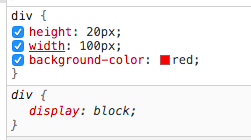

[TOC]


# 1、选择器补充

- id和元素是一对一关系

- class和元素是多对多关系

  ```html
  <div class="demo1 demo2">该元素被两个class选中（demo1和demo2）</div>
  ```

- 标签选择器选中一类标签

- 通配符选择器：`* {CSS_code}`，它选择所有标签

- 属性选择器：`[id] {CSS_code}`，该属性选择器可以选择所有id属性的标签（可以加值，如`[id="name"]`）

- 并列选择器：用多个限制条件选中一个元素，如`div.demo {CSS_code}`（div标签和demo属性并列）

- 分组选择器：多个选择器共用一个CSS代码，如`div, p.demo, #idp {CSS_code}`

  - 同一个选择器之间是不会覆盖的（只要内容不冲突）

- 伪类选择器：一个例子如下

  ```
  a:hover{
  	text-decoration:underline;
  	color:blue;
  }
  ```

  - 该例子中，当鼠标移到链接上时，链接字体会变成蓝色，并加上下划线

- 伪元素选择器

  - 伪元素存在任意一个标签里，可以用CSS操作伪元素，但是伪元素没有html结构

  - 伪元素选择的语法如下：

    ```css
    span::before{
    	content:...;
      ...
    }
    span::after{
      content:...;
      ...
    }
    ```

    - before用来选择逻辑最前面的伪元素
    - after用来选择逻辑最后面的伪元素
    - 伪元素可操作的属性和普通的选择器没有区别

  - 伪元素是原生的行级元素，可以通过CSS改为行块级元素

    - `position`和`float`属性会在内部将元素变为`inline-block`类型元素

- 优先级：id > class = 属性 > 标签 > 通配（class和属性根据先后顺序判断执行哪个）

# 2、权重

- 各种选择器是有权重的，如下

  | 选择器                                  | 权重     |
  | --------------------------------------- | -------- |
  | 行间样式                                | 1000     |
  | id选择器                                | 100      |
  | class选择器 \| 属性选择器 \| 伪类选择器 | 10       |
  | 标签选择器 \| 伪元素选择器              | 1        |
  | 通配符选择器                            | 0        |
  | !important                              | Infinity |

  - 权重的进制是256进制

# 3、复杂选择器及其权重计算

- 父子选择器，即上下文选择器

- 直接子元素选择器，即子选择器

- 当遇到复杂选择器时，应该计算其权重，例子如下

  ```css
  #id_value p{CSS_code}  /* 权重=100+1 */
  div .class_value{CSS_code}  /* 权重=10+1 */
  ```

- 当权重相同时，后面的选择器会覆盖前面的选择器

- CSS中，Infinity+1 > Infinity，Infinity*2 > Infinity

# 4、设置字体颜色

- 有三种方法设置字体颜色
  - 纯英文单词（测试用，开发不能用）
  - 颜色代码
    - （光学）三原色：rgb，颜色代码由三原色组成
    - 颜色代码组成：是三个十六进制数组成的，如`#000000`表示red的程度是00，green的程度是00，blue的程度是00，所有三原色的程度取值范围是`00-ff`
  - 颜色函数
    - `rgb(num1, num2, num3)`    这个是十进制的数
- 透明颜色：`transparent`

# 5、文本设置

- `line-height`属性设置单行文本高度

  - 如何实现文本居中：

    - 水平方向上：使用`text-align`属性设置
    - 垂直方向上：使单行文本高度=容器高度，即`line-height=height`

    ```css
    div{
    	height: 50px;
    	width: 200px;
    	background-color: yellow;
    	text-align: center;
    	line-height: 50px;	
    }
    ```

    - 效果如下：

    <div style="height: 50px;
    	width: 200px;
    	background-color: yellow;
    	text-align: center;
    	line-height: 50px;	">文本居中的例子</div>

- 汉字缩进：使用`text-indent`属性设置

  ```css
  div{
  	height:40px;
  	width:200px;
  	background-color:yellow;
    line-height:20px;
  	text-indent:2em;
  }
  ```

  - 效果如下

  <div style="height:40px;
  	width:200px;
  	background-color:yellow;
    line-height:20px;
  	text-indent:2em;">这是一个例子，可以实现首行两个缩进。</div>

# 6、单位问题

- 单位分两种，一种是绝对单位，另一种是相对单位
- CSS中的相对单位：`px`和`em`
  - px单位：这个是以像素为单位
    - 一个像素只能显示一个颜色
    - 分辨率 = 像素点/英寸（垂直方向）
  - em单位：以文本大小为单位，即`1 em = 1 * font-size`
    - font-size是用来设置字体的大小的（实际上是设置字体高度）
    - 所以`text-indent:2em`表示缩进两个汉字，因为em的单位是字体大小

# 7、CSS中元素分类

- CSS中将元素分为三类：行级元素（inner）、块级元素（block）和行级块元素（inner-block）

  - inner：内容决定元素所占位置，不可以通过CSS改变宽高
  - block：独占一行，可以通过CSS改变宽高
  - inner-block：内容决定大小（不独占一行），CSS可以改变宽高

- html中每个标签都是有原生的分类定义的，如div标签是块级元素

  

  - 可以通过在CSS中更改元素的`display`属性来改变元素的类别

- 注意：凡是带有inner类别的元素，都有文字特性，比如``标签

  - 文字特性（以img为例）：在html源码中若两个img标签之间有空格（不管几个），表现在网页中就是会产生间隙，这是文字的分隔特性，解决方法是让两个img标签挨着，中间不要有空格符

# 8、自定义标签

- 每个标签都是有原生的CSS设置的，比如说所有标签都自带`margin`属性

- 但是通常我们都不需要`margin`属性，可以在CSS通过自定义标签来去除这个属性，如下

  ```css
  *{
    padding:0;
  	margin:0;
  }
  ```

  - 这样所有标签的`margin`和`padding`属性都被初始化为0，而且通配符选择器权重是最低的，可以被其它任意选择器覆盖，修改灵活

- 事实上标签选择器的最重要一个功能就是自定义（或者说初始化）一个标签的属性


