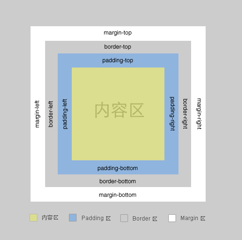

[TOC]

# 1、CSS基本语法

## （1）单选择器

```css
selector {
	property:value;
	property:value;
	...
	property:value;
}
```

## （2）多选择器

```css
selector1, selector2, ..., selectorN {
	property:value;
	property:value;
	...
	property:value;
}
```

# 2、CSS引入方法

## （1）行内引入（行间样式）

**在html标签中引入**

```html
<p style="color:green;">行内引入</p>
```

<p style="color:green;">行内引入</p>
## （2）内嵌式引入（页面样式）

```html
<!DOCTYPE html>
<html>
	<head> 
  	<title>CSS</title> 
  	<style type=“text/css”>
  		p { color:red;} 
  	</style>
	</head>
	<body>
		<p>内嵌式引入</p> 
  </body>
</html>
```

## （3）链接式引入

在`<head>`标签中加入链接

```html
<link href="url" type="text/css" rel="stylesheet">
```

- 三种引入方法的优先级为：行内引入>内嵌式引入>链接式引入
- CSS注释：`/*注释*/`

# 3、CSS颜色属性

- color：可选值如下
  - 颜色名称：如orange、green
  - RGB：如rgb(255, 165, 100)
  - RGBA（半透明RGB，CSS3才有）：rgba(255, 165, 100, 0.5)
  - HEX：#ffa500
- background-color：背景颜色，同上

# 4、font属性

|     属性     |       描述       |                       值                        |
| :----------: | :--------------: | :---------------------------------------------: |
|  font-style  |     是否倾斜     |             normal、italic、oblique             |
| font-weight  |     是否加粗     | normal、bold、bolder、lighter、inherit、100-900 |
|  font-size   |     字体大小     |             单元值、百分比、命名值              |
| font-family  |     所用字体     |           字体名称，如"宋体"，"黑体"            |
| font-variant |  设定大小写字母  |           normal、small-caps、inherit           |
|     font     | 设置所有字体属性 |      按style、weight、size、family顺序设置      |

```css
p {
	font: italic bold 14px "黑体";
}
```

# 5、text属性

|      属性       |         描述         |                       值                       |
| :-------------: | :------------------: | :--------------------------------------------: |
|   text-align    |      行内容对齐      |          left、center、right、justify          |
| text-decoration |       文本修饰       | underline、overline、line-through、blink、none |
| text-transform  |      设置大小写      |        capitalize、uppercase、lowercase        |
|  text-overflow  | 处理太长文本（CSS3） |         clip、ellipsis、ellipsis-word          |
|   text-shadow   | 设置文本阴影（CSS3） |        如`text-shadow:px px px #ff0000`        |
|   line-height   |       设置行高       |                 px、pt、em、%                  |
| letter-spacing  |     设置字符间距     |                 px、pt、em、%                  |
|  word-spacing   |      设置字间距      |                 px、pt、em、%                  |

```html
<p style="text-shadow:2px 2px 3px red;">设置阴影</p>
<!--前两个为水平和垂直偏移量，第三个为阴影本身宽度，最后一个为阴影颜色-->
```

<p style="text-shadow:1px 1px 2px red;">设置阴影</p>
# 6、background属性

|         属性          |        描述        |                        值                        |
| :-------------------: | :----------------: | :----------------------------------------------: |
|   background-color    |      背景颜色      |            颜色（颜色名称、RGB、HEX）            |
|    background-img     |      背景图片      |                       url                        |
|   background-repeat   |    背景图片重复    |      repeat、repeat-x、repeat-y、no-repeat       |
| background-attachment |  背景图片是否滚动  |                  fixed、scroll                   |
|  background-position  | 背景图片的起始位置 |            水平位置、垂直位置或x%、y%            |
|      background       |    声明背景属性    | 按照color、img、repeat、attachment、position顺序 |

- background-position的值有两部分构成，分别表示垂直和水平方向
- 垂直方向：top、center、bottom；水平方向：left、center、right

# 7、list属性

- `list-style-type`属性可以设定`<ol>`的数字形式

```html
<ol style="list-style-type:lower-roman"><li>第一条</li><li>第二条</li></ol>
```

<ol style="list-style-type:lower-roman"><li>第一条</li><li>第二条</li></ol>
```html
<ol style="list-style-type:upper-roman"><li>第一条</li><li>第二条</li></ol>
```

<ol style="list-style-type:upper-roman"><li>第一条</li><li>第二条</li></ol>
# 8、CSS盒模型



- CSS盒模型的思想是每个元素的布局由四个部分构成：
  - conten area：内容显示区
  - padding：内容和边界的距离
  - border：元素的边界
  - margin：该元素边界和其它元素边界的距离
- border属性（分四条边定义）：
  - `border`：定义四条边的属性，按width、style、color顺序
  - `border-width` `border-style` `border-color` ：分别定义各个属性
  - `border-bottom` `border-left` `border-right` `border-top`：分别定义各条边属性
  - `border-collapse`：设置表格的边框的是否折叠
  - 分别定义每条边的每个属性：`border-bottom-color`，其它类似

```html
<p style="text-align:center;border:10px solid red; box-shadow:10px 10px 5px blue">border属性的应用</p>
```

<p style="text-align:center;border:10px solid red; box-shadow:10px 10px 5px blue">border属性的应用</p>

- padding属性：
  - `padding`：同时定义四条边的padding属性，按照top、right、bottom、left（顺时针）顺序
  - 分别定义四条边：`padding-top` `padding-right` `padding-bottom` `padding-left`

```css
h1 {
	padding:1em 1em 1em 1em;
}
/* 从top开始，按顺时针方向 */
h2 {
	padding:2em 2em;
}
/* 第一项指top和bottom，第二项指right和left */
```

- margin属性和padding类似，可以同时定义四条边，也可以分别定义

# 9、width属性

- width属性仅对块元素和img元素有效
- 尺寸单位可选em、px、pt、%

```html
<p style="border:2px solid red;">p元素不使用width属性</p>
```

<p style="border:2px solid red;">p元素不使用width属性</p>

```html
<p style="border:2px solid red; width:500%;">p元素width=50%</p>
```

<p style="border:2px solid red; width:50%;">p元素width=50%</p>

```html
<span style="border:2px solid red;">span元素不使用width</span>
```

<span style="border:2px solid red;">span元素不使用width</span>

```html
<span style="border:2px solid red;width:100%;">span元素width=100%</span>
```

<span style="border:2px solid red; width:100%;">span元素width=100%</span>


资料来源：

[中国mooc：Web编程](https://www.icourse163.org/learn/XJTU-1003679001?tid=1206704206#/learn/content?type=detail&id=1211700436)