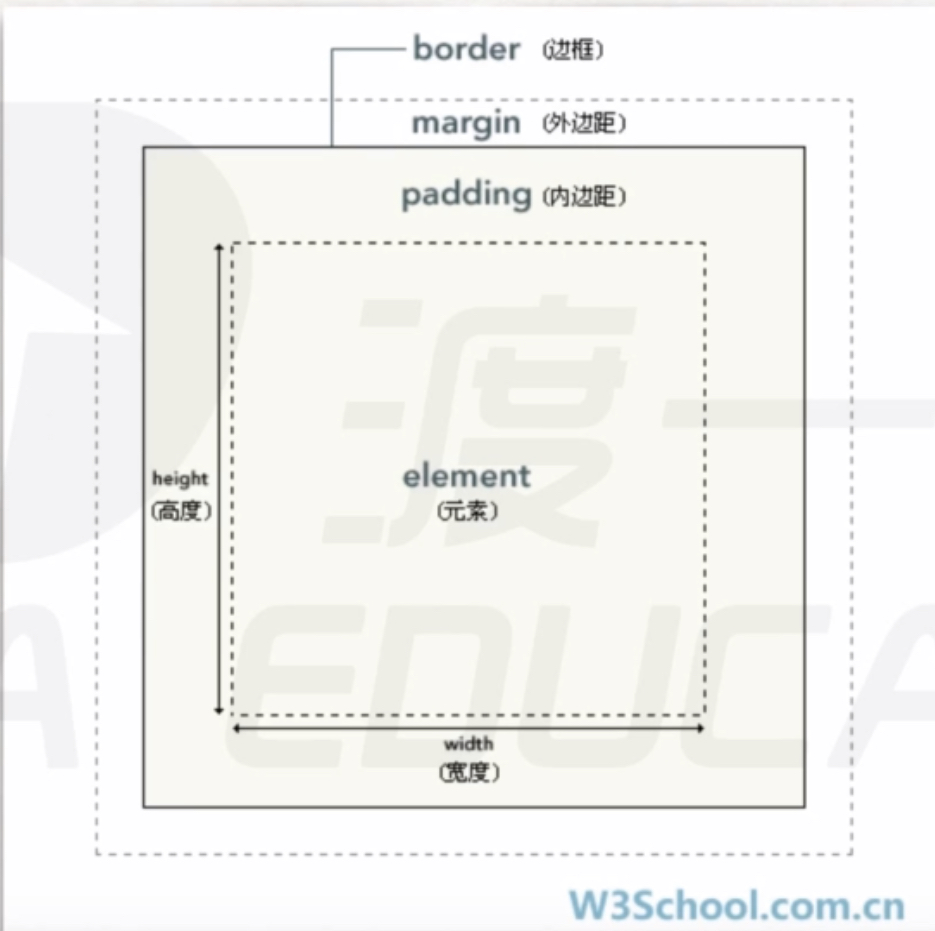

[TOC]

# 1、盒模型

- CSS中，每个元素都被视为一个盒模型
- 盒模型 = 盒子（height、width、border和padding属性） + 外边距（margin属性）



- 在盒模型中，子元素只能位于父元素的内容区（元素区），该区域大小由height和width属性决定

- 例子：利用盒模型做一个远视图

  - html代码如下：

  ```html
  <div class="wrapper">  <!--最外层容器，用于实现居中-->
    <div class="content1">
      <div class="content2">
        <div class="content3">
          <div class="content4">
            <div class="content5">
              <div class="content6"></div>
            </div>
          </div>
        </div>
      </div>
    </div>
  </div>
  ```

  - CSS代码如下

  ```css
  *{
  	margin: 0;
  	padding: 0;
  	border: 0;
  }
  
  .wrapper{
  	position: absolute;
  	left: 50%;
  	top: 50%;
  	margin-left: -65px;  /* wrapper的大小是130*130，left和top定位是以左边框和上边框为边界的 
    												所以需要将wrapper往回挪动一点*/
  	margin-top: -65px;
  }
  
  .content6{
  	height: 10px;
  	width: 10px;
  	background-color: green;
  	border: 10px solid white;
  }
  
  .content5{
  	height: 30px;  /* 要实现盒内元素居中，就要使外层的内容区大小和内层的盒子大小一样
    									比如content6总大小是30*30（margin不加入计算），所以content5内容区大小要一样*/
  	width: 30px;
  	border: 10px solid green;
  }
  
  .content4{
  	height: 50px;
  	width: 50px;
  	border: 10px solid white;
  }
  
  .content3{
  	height: 70px;
  	width: 70px;
  	border: 10px solid green;
  }
  
  .content2{
  	height: 90px;
  	width: 90px;
  	border: 10px solid white;
  }
  
  .content1{
  	height: 110px;
  	width: 110px;
  	border: 10px solid green;
  }
  ```

  - 效果如下

    

# 2、层模型

## （1）定位

- position属性用于定位，它有3个取值——`"absoluate", "relative", "fixed"`
- position属性只和left、top属性配合（或者right、bottom属性），参照对象是文档边框

## （2）position属性3个取值区别

- `position: absoluate;`    绝对定位
  - 当一个元素成了absoluate定位元素后，它就脱离了原来所在的层，到了更高的一层
  - absoluate相对于最近的有定位（即有position属性）的父级进行定位，如果没有这样的父级元素，就相对于文档边框定位
- `position: relative;`    相对定位
  - 当一个元素成了relative定位元素后，它也脱离原来所在的层，但是它会保留原来所占据的位置
  - relative相对于自己原来的位置定位
- `posiotion: fixed;`    固定定位
- `relative`和`absoluate的`区别
  - absolute的基准点是第一个设了position的祖先，relative的基准点是它“原本应该在的位置”，所谓设了position，就是position设成relative、absolute、fixed、sticky这些
  - 把祖先设成position: relative，让子元素针对它定位，是很常见的手段，但不是relative的初衷，relative的初衷是让元素相对它原本的位置移位

## （3）其它

- z-index属性用来定义层的高度，就是z轴的含义，没有定位元素时，默认所有元素该属性值都是0

- 经验：一般用relative做参照物，用absoluate做定位

- 例子：如何使用定位元素实现固定居中

  ```css
  div{
    position: absoluate;
    height: 100px;
    width: 100px;
    left: 50%;
    top: 50%;
    margin-left: -50px;
    margin-top: -50px;
  }
  ```

# 3、BFC

- BFC：Block Format Context

- 正常情况下，每个盒子都有自己的渲染规则，并且相同的盒子渲染规则相同

- 我们可以通过CSS更改盒子的渲染规则，从而触发bfc

- 触发bfc的方法

  - `position: absoluate;`
  - `display: inline-block;`
  - `float: left/right;`    浮动模型
  - `overflow: hidden;`    隐藏溢出部分

- 与bfc相关的两个经典bug

  - margin塌陷

    - 父子嵌套的元素的margin属性在垂直方向是结合到一起的，取更大的那个

      ```html
      <div style="height:100px; width:100px; background-color:black; margin-top:100px; 						 margin-left:100px;">
      	<div style="height:50px; width:50px; background-color:red; margin-top:100px; 								margin-left:50px;">
        </div>
      </div>
      ```

      - 可以看到子元素的margin-left有作用，但是子元素的margin-top不起作用

      <div style="height:100px; width:100px; background-color:black; margin-top:100px; 							margin-left:100px;">
      	<div style="height:50px; width:50px; background-color:red; margin-top:100px; 								margin-left:50px;"></div>
      </div>

    - 解决办法：使父级元素成为bfc元素，如下

      <div style="position: absolute; 
                  height:100px; width:100px; background-color:black; margin-top:100px; 							margin-left:100px;">
      	<div style="height:50px; width:50px; background-color:red; margin-top:50px; 								margin-left:50px;"></div>
      </div>

    

    

    

    

    

    

  - margin合并

    - 同级元素垂直方向margin合并（原因是文本类元素有分隔符）

      ```html
      <div style="background-color: green; margin-bottom: 16px">1</div>
      <div style="background-color: yellow; margin-top: 16px">2</div>
      ```

      - 问题：第一个的div的margin-bottom和第二个div的margin-top合并了

      <div style="background-color: green; margin-bottom: 16px">1</div>
      <div style="background-color: yellow; margin-top: 16px">2</div>

    - 解决办法：给它们一个父级元素，使父级元素触发bfc（最好不用，这样改变了结构）

# 4、浮动模型

- `float: left/right;`    
  - left是指从左向右排队，right是指从右向左排队
  - 效果：浮动元素产生浮动流
    - 所有产生了浮动流的元素，只有块级元素看不到它们
    - bfc元素/文本类元素（inline）可以看到浮动元素
  - 浮动规则：浮动元素以父级元素为边界，溢出时换行（排队效果）

- 浮动流的一个小bug

  - 浮动流导致父级元素不能包住子级元素

  - 例子如下

    ```html
    <div style="width: 200px; border: 5px solid red;">
      <div style="float:left; margin:5px; background-color:black; height: 30px; width: 60px"></div> 
    	<div style="float:left; margin:5px; background-color:black; height: 30px; width: 60px"></div>
      <div style="float:left; margin:5px; background-color:black; height: 30px; width: 60px"></div>
      <div style="float:left; margin:5px; background-color:black; height: 30px; width: 60px"></div>
      <div style="float:left; margin:5px; background-color:black; height: 30px; width: 60px"></div>
    </div>
    ```

    - 效果如下，可以看到子级元素不能撑开父级元素，因为父级元素是块级元素，它看不到浮动元素

    <div style="width: 200px; border: 5px solid red;">
      <div style="float:left; margin:5px; background-color:black; height: 30px; width: 60px"></div> 
    	<div style="float:left; margin:5px; background-color:black; height: 30px; width: 60px"></div>
      <div style="float:left; margin:5px; background-color:black; height: 30px; width: 60px"></div>
      <div style="float:left; margin:5px; background-color:black; height: 30px; width: 60px"></div>
      <div style="float:left; margin:5px; background-color:black; height: 30px; width: 60px"></div>
    </div>


- 解决bug的方法：对某一元素使用`clear: both`属性，清除该元素周边的浮动流（该属性只对块级元素生效）
  - 错误的解决办法：在最后一个逻辑子元素后面添加一个非块级元素（如p标签）
    - 一般不能改动结构（这个方法添加了html标签）
  - 正确的解决办法：在最后一个逻辑子元素添加属性`clear:both`（使用伪元素选择器`after`），清除浮动流，或者叫触发bfc


